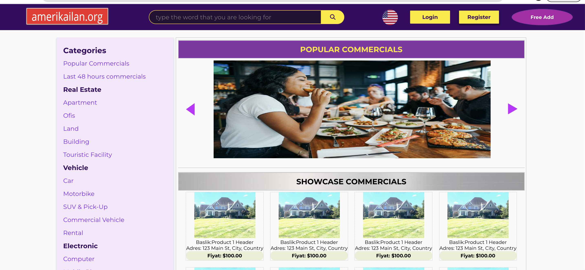
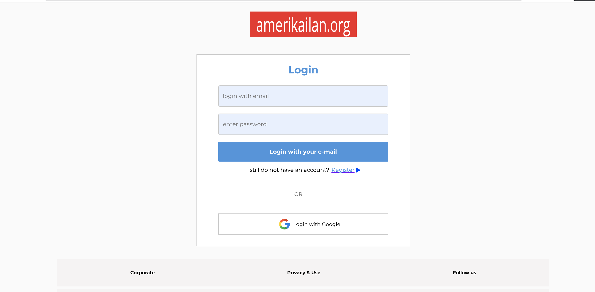
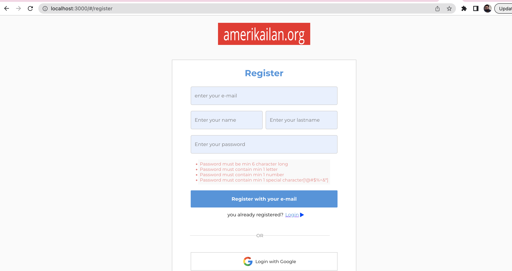
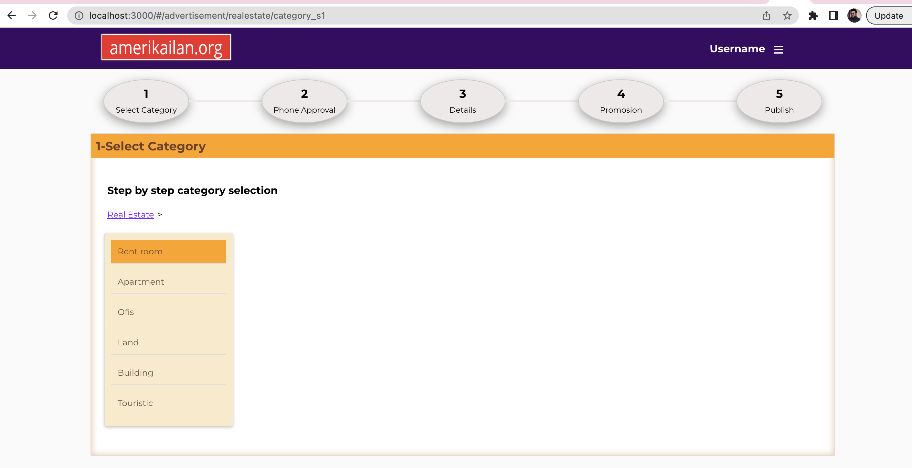
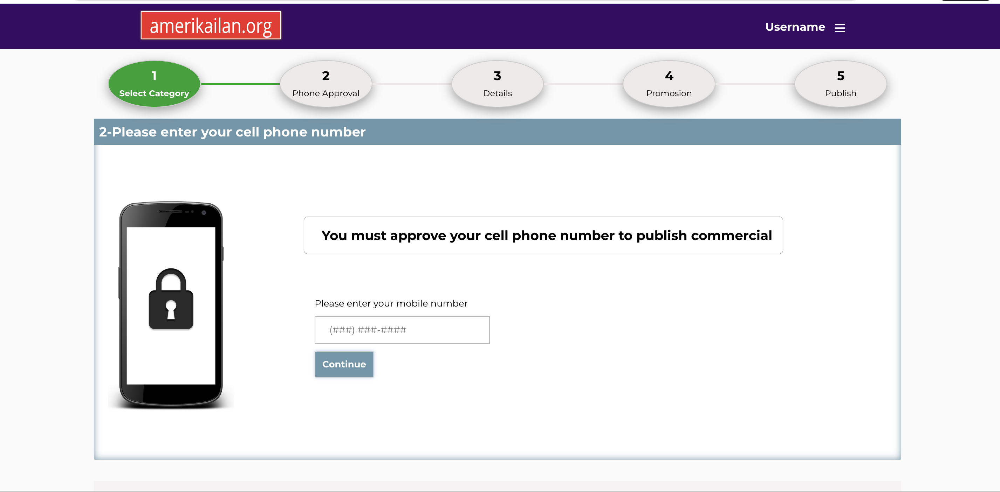
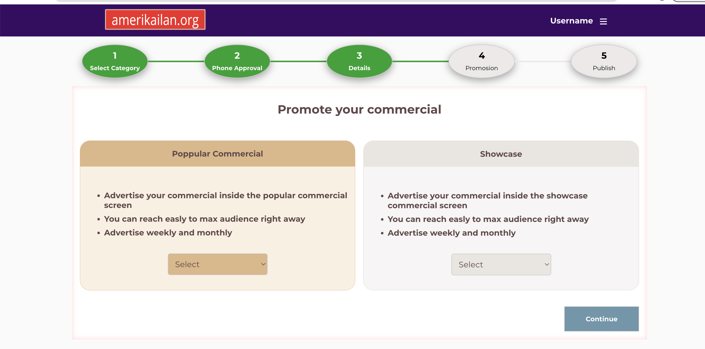
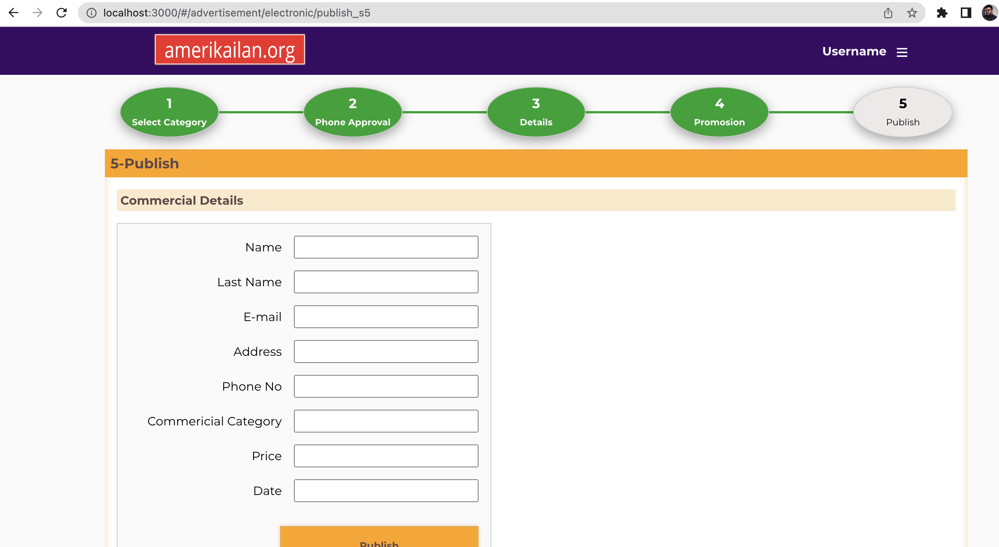

# AmerikaIlan.org - React Project

## Table of Contents

1. [Project Name and Description](#1---project-name-and-description)

   - [Project Name](#project-name)
   - [Description](#description)
   - [Why AmerikaIlan.org](#why-amerikailanorg)
   - [Key Aims](#key-aims)
   - [Inspiration](#inspiration)
   - [Beyond Expectations](#beyond-expectations)

2. [Installation Instructions](#2---installation-instructions)

   - [Clone the Repository](#1-clone-the-repository)
   - [Install Dependencies](#2-install-dependencies)
   - [Run the Application](#3-run-the-application)
   - [Access the Application](#4-access-the-application)

3. [Usage](#3---usage)

   - [Navigate through Ads](#1-navigate-through-ads)
   - [Contribute to Ads](#2-contribute-to-ads)
   - [Manage Account Information](#3-manage-account-information)

4. [Technologies Used](#4---technologies-used)

   - [React](#1-react)
   - [JSX](#2-jsx)
   - [CSS](#3-css)
   - [JavaScript](#4-javascript)

5. [Features](#5---features)

   - [Secure Account Creation and Authentication](#1-secure-account-creation-and-authentication)
   - [Effortless Account Login and Logout](#2-effortless-account-login-and-logout)
   - [Ad Publishing and Interaction](#3-ad-publishing-and-interaction)
   - [Personalized Ad Management](#4-personalized-ad-management)
   - [Ad Exploration and Interaction](#5-ad-exploration-and-interaction)
   - [Secure Sign-Out Functionality](#6-secure-sign-out-functionality)

6. [Upcoming Features](#6---upcoming-features)

   - [Account Management](#1-account-management)
   - [Contributions Count and Ad History](#2-contributions-count-and-ad-history)
   - [User Levels and Rewards](#3-user-levels-and-rewards)
   - [Advantages for Each Level](#4-advantages-for-each-level)
   - [Enhanced User Control](#5-enhanced-user-control)
   - [Upcoming Features: CSS Enhancements](#6-upcoming-features-css-enhancements)

7. [Screenshots or GIFs](#7---screenshots-or-gifs)

8. [Contributing Guidelines](#8---contributing-guidelines)

   - [Fork the Repository](#8-1-fork-the-repository)
   - [Clone the Repository](#8-2-clone-the-repository)
   - [Create a Branch](#8-3-create-a-branch)
   - [Make Changes](#8-4-make-changes)
   - [Commit Changes](#8-5-commit-changes)
   - [Push Changes](#8-6-push-changes)
   - [Submit a Pull Request](#8-7-submit-a-pull-request)
   - [Code Review](#8-8-code-review)
   - [Merge Pull Request](#8-9-merge-pull-request)

9. [License](#9---license)

## 1 - Project Name and Description

### Project Name

AmerikaIlan.org.

### Description

This repository contains the frontend of AmerikaIlan.org, a web platform allowing users to create accounts, publish advertisements, chat and meet others. The project aims to deliver a user-friendly experience similar to popular online marketplaces.

### Why AmerikaIlan.org

In an era of digital information sharing, AmerikaIlan.org provides a platform for users to engage in open dialogue, share insights, and connect with like-minded individuals. It serves as a hub for diverse perspectives, facilitating the exchange of ideas and knowledge. AmerikaIlan.org stands out as one of the alternative ways to traditional paid advertising websites. Users have the freedom to add free advertisements across various categories such as real estate, vehicles, electronics, job searches, and more. Additionally, the platform encourages social interactions, allowing users to chat and meet, fostering a vibrant and collaborative community experience. Join AmerikaIlan.org to explore a cost-effective and inclusive approach to online advertising and networking.

### Key Aims

1. **Community Engagement:**
   AmerikaIlan.org strives to enhance user interaction and collaboration within the realm of classified advertisements. Users can actively engage with one another, sharing experiences related to various ads, and building connections within a virtual marketplace.

2. **Knowledge Sharing:**
   As a platform centered around classified ads, AmerikaIlan.org provides users with the opportunity to contribute valuable insights related to advertised products and services. This collaborative approach fosters an environment where users can share their expertise, enhancing the overall understanding of the offerings within the marketplace.

### Inspiration

Drawing inspiration from the dynamic and user-centric attributes of popular online marketplaces, AmerikaIlan.org embraces these qualities to cultivate swift and meaningful interactions. The platform is motivated by the goal of encapsulating the vitality of dynamic discussions within a broader and collaborative environment, redefining the conventional marketplace experience.

### Beyond Expectations

While AmerikaIlan.org caters to conventional marketplace functionalities, it also introduces innovative features that transcend expectations. From intuitive user interfaces to novel ways of ad discovery, the application strives to redefine the marketplace experience.

Embrace AmerikaIlan.org as not just a digital marketplace but a dynamic space where ads flourish, connections form, and users actively shape the narrative. Join the marketplace and explore the limitless possibilities within AmerikaIlan.org.

## 2 - Installation Instructions

To set up the AmerikaIlan.org front-end application developed with React, follow these simple steps:

1. **Clone the Repository**

```bash
git clone https://github.com/your-username/amerikailan.org.git
cd amerikailan.org
```

2. **Install Dependencies**

```bash
npm install
```

3. **Run the Application**

```bash
npm start
```

4. **Access the Application**

Open your browser and navigate to

http://localhost:3000 to view AmerikaIlan.org.

That's it! You've successfully installed and launched the AmerikaIlan.org front-end application. Dive into the world of dynamic ads and collaborative interactions.

## 3 - Usage

The AmerikaIlan.org front-end application is designed to offer a seamless and engaging experience for users. Here's how you can make the most of its features:

1. **Navigate through Ads**

Explore diverse ads by navigating through different categories. Click on the ads to view details and participate in discussions.

2. **Contribute to Ads**

Engage actively by creating your own ads. Share your products, services, or questions to initiate meaningful interactions within the community.

3. **Manage Account Information**

Users have the ability to manage their accounts, update profile information, and monitor their published ads. The platform prioritizes user privacy and account customization.

## 4 - Technologies Used

1. **React**

Leveraging the power of React, the application achieves a responsive and dynamic user interface. React's component-based architecture facilitates modular development and seamless updates.

2. **JSX**

JSX, a syntax extension for JavaScript, is employed to enhance the readability of the codebase. It allows the blending of HTML-like tags within JavaScript, streamlining the creation of interactive user interfaces.

3. **CSS**

Cascading Style Sheets (CSS) is utilized to style and design the application, ensuring a visually appealing and cohesive presentation. Custom styling enhances the user experience and aligns with modern design principles.

4. **JavaScript**

JavaScript is employed for adding interactivity and functionality to the application. From handling user interactions to managing asynchronous requests, JavaScript enhances the overall responsiveness of AmerikaIlan.org.

## 5 - Features

1. **Secure Account Creation and Authentication**

Users can securely create accounts using unique credentials. AmerikaIlan.org employs robust authentication mechanisms to ensure the privacy and security of user information.

2. **Effortless Account Login and Logout**

Once registered, users can seamlessly log in to their accounts, providing a personalized and secure experience. The logout feature ensures a secure session termination, prioritizing user privacy.

3. **Ad Publishing and Interaction**

Users are empowered to publish ads, fostering a diverse range of discussions. They can actively engage with other users by liking and commenting on ads, contributing to a dynamic and collaborative marketplace environment.

4. **Personalized Ad Management**

AmerikaIlan.org offers users the ability to create, comment on, and like ads. Each user can manage and interact with the ads they've published, enhancing a sense of ownership and contribution within the community.

5. **Ad Exploration and Interaction**

Users can explore and interact with ads published by others. The platform promotes a vibrant marketplace atmosphere, encouraging users to read, like, and comment on ads contributed by their peers.

6. **Secure Sign-Out Functionality**

Users can securely sign out of their accounts to ensure the protection of their personal information. The sign-out feature guarantees a complete and secure session closure.

These features collectively provide users with a comprehensive and secure experience within AmerikaIlan.org. From account creation to active participation in discussions, the platform prioritizes user privacy, engagement, and seamless interaction.

## 6 - Upcoming features

1. **Account Management**

Users will have the capability to manage their accounts, allowing them to modify profile information and update passwords. This feature enhances user control and customization within AmerikaIlan.org.

2. **Contributions Count and Ad History**

Users can track their contributions through a contributions count, providing insights into their active participation within the marketplace. Additionally, users will be able to view a history of their previous ads, creating a comprehensive overview of their engagement.

3. **User Levels and Rewards**

Introducing a tiered user level system, including levels based on user contributions. Each level will come with unique advantages, fostering a sense of achievement and recognition within the community.

4. **Advantages for Each Level**

Users at different levels will receive exclusive benefits, though the specific details of these advantages are yet to be decided. This upcoming feature aims to enhance user experience and engagement, providing incentives for active participation.

5. **Enhanced User Control**

In addition to the upcoming features, users will soon gain the ability to manage their content more effectively with the introduction of an ad deletion feature. This empowers users with greater control over their contributions, allowing them to curate and refine their presence within the marketplace. The deletion feature aligns with AmerikaIlan.org's commitment to providing users with a personalized and customizable experience, ensuring that their engagement with the platform remains in their hands.

6. **Upcoming Features: CSS Enhancements**

- **Custom Styling Options:**
  Explore upcoming features that offer users the ability to apply custom styling to their ads. Tailor the appearance of your contributions to express your unique style within AmerikaIlan.org.
- **Theme Customization:**
  Soon, users will have the opportunity to personalize their marketplace experience further by choosing from a variety of themes. Whether it's a light or dark theme, customization options will be

- **Responsive Design Improvements:**
  Stay tuned for CSS enhancements aimed at refining the responsive design of AmerikaIlan.org. The upcoming improvements will ensure a consistent and user-friendly experience across various devices.
  User Profile Customization:
  Users will soon be able to enhance the visual appeal of their profiles by customizing the appearance through CSS. Showcase your personality and preferences within the community with unique profile styles.
  As we continually work on enhancing the CSS features of AmerikaIlan.org, we are committed to providing users with a visually appealing and customizable platform. Keep an eye out for updates as we strive to create an even more engaging and aesthetically pleasing marketplace experience.

## 7 - Screen Shots

Home Page Screenshot


Login View Screenshot


Register View Screenshot


Category Selection Screenshot


Phone Approval Screenshot


Promotion Page Screenshot


Publish Page Screenshot


Published Page Screenshot


## 8 - Contributing Guidelines

We appreciate your interest in contributing to the AmerikaIlan.org project. Your contributions play a vital role in enhancing the overall experience for our users. Before you get started, please take a moment to review the following guidelines:

1. **Fork the Repository**
   Fork the AmerikaIlan.org repository to your GitHub account.

2. **Clone the Repository**
   Clone the forked repository to your local machine using the following command:

git clone https://github.com/your-username/amerikailan.org.git
cd amerikailan.org

3. **Create a Branch**

Create a new branch for your contributions:

git checkout -b feature/your-feature-name
Make Changes:
Implement your desired changes, enhancements, or fixes within your branch.

4. **Commit Changes**
   Commit your changes with clear and concise commit messages:
   git commit -m "Brief description of your changes"

5. **Push Changes**

git push origin feature/your-feature-name

6. **Submit a Pull Request**
   Create a pull request from your branch to the main repository's develop branch. Be sure to provide a detailed description of your changes.

7. **Code Review**
   Expect feedback and engage in discussions related to your pull request. Make any necessary adjustments based on the feedback received.

8. **Merge Pull Request**
   Once your pull request is approved, it will be merged into the main repository.

Thank you for your contributions! Your efforts contribute to the growth and improvement of the AmerikaIlan.org project.

## 9 - License

The AmerikaIlan.org project is licensed under the [amerikailan.org]. This license grants users the freedom to use, modify, and distribute the software within the terms specified in the license document.
